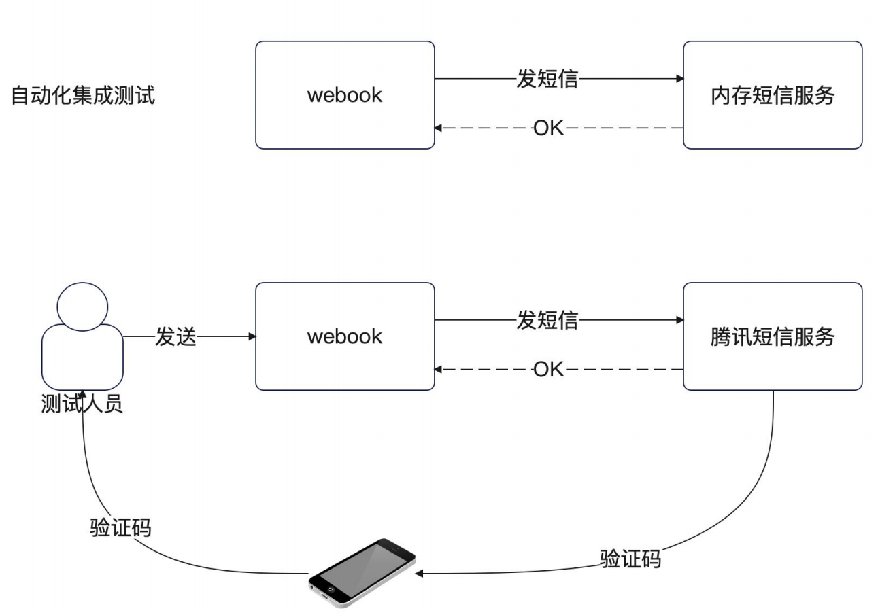

+++
title = '集成测试'
date = 2025-08-29T20:13:50+08:00
draft = true
categories = [ "Programming" ]
tags = [ "programming", "go" ]
+++

# 集成测试

单元测试只能确保任何一个组件单独看是没有任何问题的。但是组合在一起是否有问题，就需要集成测试了。

在日常开发中，这一步主要是由测试来进行的。但你也可以考虑先提前用集成测试验证一下自己维护的所有模块。

举例来说，如果整个业务需要 A、B、C 三个模块通力合作。而你作为研发维护了 A 和 B 两个，那么你就可以先测试 A 和 B 集成的效果。

现在我们准备测试整个链路。即测试从收到请求，到返回响应的整个过程。

这种整个链路的测试和单元测试比起来：
- 单元测试用例设计是以实现逻辑为依据的（即便用 TDD 也是这样）。
- 集成测试用例设计是以业务流程为依据的。
- 有些系统错误是由程序员编码造成的，实际用户根本不可能触发，这一类很难测试，或者说几乎不可能在集成测试里面测到。
- 有一些异常流程，是需要考虑并发的，这一类集成测试也很难测试到，依赖于人手工测试。


# 集成测试：以发送验证码为例

现在我们看第一个发送验证码的集成测试。这个测试的困难就在于：我们希望测试的验证码是真的发到了手机上，然而这是一个不可能的事情，因为我们没有办法通过手机来验证究竟有没有收到验证码。

而且，类似于发送短信这种功能，你不好发给谁，也不能浪费公司买的短信资源，所以都是用内存实现来自动化集成测试 + 测试人员手动发送验证码双层验证。



# 定义测试用例

整个测试用例分成了几个部分：

- name： 测试名字。
- before：准备数据。
- after：验证并且删除数据。
- phone：前端只需要传入一个手机号码，所以这里我就直接定义了。标准做法是这里定义为http.Request。
- 预期响应
- wantCode：HTTP 状态码。
- wantResult：预期数据，因为直接比较JSON 很麻烦，所以直接比较 web.Result。

集成测试，入口还是从Handler开始，但是它需要依赖Gin Server、Service 等层提供的服务，还要考虑经过各种Middleware，它不是单元测试，这些在继承测试中就不能再模拟了。现在的问题是不能mock这些层提供的服务，那该如何操作呢？

想一想 main 函数是如何初始化的？
```go
func InitWebServer() *gin.Engine {
	logger := ioc.InitLogger()
	cmdable := ioc.InitRedis()
	handler := jwt.NewRedisJWTHandler(cmdable)
	v := ioc.InitMiddlewares(logger, cmdable, handler)
	db := ioc.InitDB(logger)
	userDAO := dao.NewUserDAO(db)
	userCache := cache.NewUserCache(cmdable)
	userRepository := repository.NewUserRepository(userDAO, userCache)
	userService := service.NewUserService(userRepository, logger)
	codeCache := cache.NewCodeCache(cmdable)
	codeRepository := repository.NewCodeRepository(codeCache)
	smsService := ioc.InitSMSService(cmdable)
	codeService := service.NewCodeService(codeRepository, smsService)
	userHandler := web.NewUserHandler(userService, codeService, handler)
	engine := ioc.InitWebServer(v, userHandler)
	return engine
}
```

然后也是一样的构造输入请求，除了不能mock外，我们要考虑的是准备数据和验证数据，由于是要和数据库以及Redis打交道，所以要验证这些里面的数据是否正确。代码框架如下：

```go
func TestUserHandler_e2e_SendLoginSMSCode(t *testing.T) {
	server := startup.InitWebServer()
	rdb := ioc.InitRedis()

	testCases := []struct {
		name string

		before  func(t *testing.T) // 开始准备数据
		after   func(t *testing.T) // 结束验证数据，数据库的数据对不对，Redis的数据对不对
		reqBody string

		wantCode int
		wantBody web.Result
	}{
		
	}

	for _, tc := range testCases {
		t.Run(tc.name, func(t *testing.T) {
			tc.before(t)
			req, err := http.NewRequest(http.MethodPost,
				"/users/sms/code", bytes.NewBuffer([]byte(tc.reqBody)))
			require.NoError(t, err)

			// 数据是 JSON 格式
			req.Header.Set("Content-Type", "application/json")
			// 这里你就可以继续使用 req

			resp := httptest.NewRecorder()

			server.ServeHTTP(resp, req)

			assert.Equal(t, tc.wantCode, resp.Code)
			if resp.Code != 200 {
				return
			}

			var webRes web.Result
			err = json.NewDecoder(resp.Body).Decode(&webRes)
			require.NoError(t, err)
			assert.Equal(t, tc.wantBody, webRes)

			tc.after(t)
		})
	}
}

```

运行测试用例
整个代码分成几部分：
- 执行 before：也就是准备数据。
- 构建 req。
- 准备 recorder。
- 调用 ServeHTTP。
- 比较结果：
- 比较响应码。
- 将响应数据反序列化为 JSON 之后再比较。


# 总结

集成测试和单元测试比起来，有一些不同点：

- 集成测试需要手动准备数据。
- 集成测试在测试之后，要验证数据是否符合预期。注意：
- 你直接使用的第三方依赖，你需要验证，比如说 Redis、MySQL 之类的。
- 你调用别人的接口，就不需要验证，你只需要验证它返回的响应就可以。

注意：永远不要让测试用例之间互相依赖。

比如说在这里发送太频繁的用例完全可以依赖于存储成功用例，但是不要这么做！！！！相互之间有依赖关系的测试用例非常难维护！！！后续一重构就各种崩溃，你都改不过来！！！