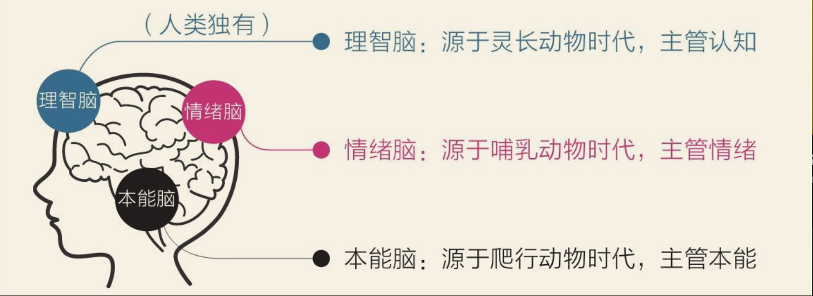

**我的  ·  [心理学](/reading/psychology)  ·  [哲学](/reading/philosophy)  ·  [计算机科学](/reading/computing)  ·  [工具](/reading/manuals)**

---

> **《认知觉醒》 读后感**

[返回书架](/reading/mine)


今吾得一无上心法，该心法分为上下两篇，上篇内修，下面外练。


## 上篇　内观己身，破除心魔

### 第一章　识海玄机：万般烦恼之源

#### 第一节　探秘识海：重识真我

吾观世人多迷茫，皆因不识己身，更遑论掌控命运。此处所言‘己身’，乃是指人之识海，盖因识海乃人之根本，若无识海，则形同虚无；若有识海而不识，则如盲人摸象，终难觅得真谛。

欲破除心魔，须先探秘识海，由此重识真我，方可踏上修行之路，成就无上道果。


```markdown
#### 第一节　探秘识海：重识真我

吾观世人多迷茫，皆因不识己身，更遑论掌控命运。此处所言‘己身’，乃是指人之识海，盖因识海乃人之根本，若无识海，则形同虚无；若有识海而不识，则如盲人摸象，终难觅得真谛。

欲破除心魔，须先探秘识海，由此重识真我，方可踏上修行之路，成就无上道果。
```

仿照下面模板，将上面内容根据文生图万能提示词公式“主体+环境+艺术风格+媒介材料+摄像机视角+精度” 进行提取一句话。明确要求玄幻武侠风格，不要水墨画风格宣纸材质

```markdown
一个喜欢科学实验的12岁男孩，他正在实验室里操作化学试剂，光线明亮而冷色调，带有科学实验的紧张气氛。艺术风格：皮克斯动画风格，媒介材料：数字插画。摄像机视角：特写视图。作品精度定义：高分辨率，超级细节。

一个热爱舞蹈的8岁女孩，她在舞台上表演芭蕾舞，聚光灯照亮她，周围是梦幻的粉色和蓝色灯光。艺术风格：印象派画作。媒介材料：油画。摄像机视角：广角镜头。作品精度定义：高品质，复杂细节。

一个喜欢探索宇宙的10岁男孩，他在太空舱里观察星空，舱内光线柔和，充满未来感的蓝紫色调。艺术风格：赛博朋克。媒介材料：3D渲染。摄像机视角：局点透视。作品精度定义：4K分辨率，高清细节。

一个喜欢烹饪的7岁女孩，她在厨房里制作蛋糕，温暖的阳光洒在她身上，厨房充满家庭温馨的氛围。艺术风格：卡通插画。媒介材料：手绘。摄像机视角：正视图。作品精度定义：高分辨率，细节丰富。

一个喜欢历史探险的11岁男孩，他在古代遗迹中寻找宝藏，光线昏暗，气氛神秘而紧张。艺术风格：写实风格。媒介材料：雕塑。摄像机视角：全身照。作品精度定义：HD品质，细节极其丰富。
```


##### 三脉识海

人族之所以能凌驾于万物之上，皆因其拥有智慧之识海。世人皆叹其精妙绝伦，奥秘无穷，然究其根本，亦非完美无缺，反倒暗藏诸多隐患，此乃世人苦恼之源。欲解其中奥妙，需先探寻识海之演化历程。

天地初开，万物混沌，世间尚无生命迹象。然数十亿年前，远古汪洋之中，诞生了一种名为“复制子”之奇物。历经漫长岁月，受天道之力演化，逐渐化为单细胞生灵，而后分化成飞禽走兽、花草树木，以及诸多微小之物。其中，动物一脉最终演化出各种原始鱼类，游弋于无尽汪洋之中。

约莫三亿六千万年前，原始鱼类开始踏足陆地，开启了爬行动物之纪元。为适应陆地环境，爬行动物进化出最初之“本能识海”。此识海结构简单，仅有一原始反射模块，可令其对周遭环境迅速做出本能反应，譬如遇险则战或逃，遇猎物则捕食，遇心仪伴侣则求偶。爬行动物无情无智，体温亦随外界变化而起伏，然凭借此简单本能反应，不仅得以存活，更有甚者，延续至今，如鳄鱼、蜥蜴、蛇等。故而，许多学者将本能识海称为原始识海、基础识海，或鳄鱼识海、蜥蜴识海，更有甚者，直呼其为爬行识海。

约莫两亿年前，哺乳动物横空出世。为更好地适应环境，其不仅能维持体温恒定，更进化出了七情六欲。得益于情绪之力，哺乳动物得以在险恶环境中趋利避害，生存优势大增。譬如，恐惧之情可令其远离危险，兴奋之情可助其专注捕猎，愉悦之情可增进同伴亲密度，悲伤之情可引来同情关爱。此乃为何世人喜爱将猫狗视为宠物，盖因其能与人产生情感交流，懂得取悦和照顾主人。相应地，哺乳动物之识海中亦发展出一个独特的情感区域（边缘系统），脑族修士称之为“情绪识海”。在诸多哺乳动物中，猴子常被脑族修士用于观察和实验，故情绪识海亦被称为猴子识海。

直至约莫二百五十万年前，人族才从哺乳动物中脱颖而出，识海前额区域进化出“新皮层”。此新皮层直至七万至二十万年前方才成形，成为一个举世无双之脑区，赋予人族语言、艺术、科技、文明，自此雄霸天下。人族沉迷于自身独有之理智，故将此新脑区称为“理智识海”，亦有人称之为理性识海或思考识海。

由此可见，人族与世间万物已截然不同。人之识海，由内而外，至少分为三层：古老悠久之本能识海，相对久远之情绪识海，以及新晋崛起之理智识海。

然世人多不知晓其中奥妙，仅凭直觉认为世间万物皆只有一个识海，而人族仅略胜一筹。此等错误认知，犹如农夫救蛇，终将自食恶果。

## 脑海之争：高低权衡

显而易见，脑族的识海并非天生构造，而是由不同模块“堆砌”而成，犹如杂乱无章之机巧傀儡，主板古旧，显卡陈腐，唯独中央处理器焕然如新，三者共存之时，自然会产生诸多兼容之难题。

令人欣慰的是，高级之理智识海乃人族独有特质，其赋予我等远见卓识、善于权衡之能，能够立足未来，谋求长远之益。由此观之，本能识海与情绪识海的确略显低级。然而，若因此而心生自满，未免过于乐观。盖因理智识海虽为高级，但相较本能识海与情绪识海，其力量实在薄弱无比。细数理智识海弱小之缘由，至少有以下四点：

其一，论及出现年代。本能识海已有近三亿六千万年之历史，情绪识海亦有接近两亿年的传承，而理智识海不过诞生二百五十万年不到。若将本能识海比作千岁老者，则情绪识海宛若五十五岁的中年，而理智识海则如不满一岁的幼童。可知，即便此幼童聪慧过人，置于两位成年人之间，亦难免显得单薄无力。

其二，三脉识海发育成熟之时间各异。本能识海早在婴儿时期便已趋于完善，情绪识海需待青春期方才渐趋成熟，而理智识海则要至成年早期方能大致完成发育。若不拘泥于精确数字，大致可认为其分别于二岁、十二岁、二十二岁左右达到成熟，各阶段前后相差约十年，故在人生之初二十载，我族常显得心智稚嫩。

其三，我族之识海内约有八百六十亿个神经元细胞，而本能识海与情绪识海却占据近八成，故其对识海之掌控力更为强大。同时，两者距离心脏更近，一旦遇险情况，即可优先得到供血。这亦是为何我等在极度紧张之际，往往感觉识海一片空白，乃因外层之理智识海缺血所致。

其四，本能识海与情绪识海虽表面看似低级，却掌控着潜意识与生理系统，时时刻刻调控我等之视觉、听觉、触觉……调节呼吸、心跳、血压……故其运行速度极快，至少可达一千一百万次每秒，堪比世间最快之神机妙算；而理智识海之最高运行速度仅四十次每秒，相较之下无疑显得脆弱，且运行之时耗能巨大。若汝初闻此事，定会感到震惊。

##  三脉之争：权力的游戏

显而易见，我等脑族之识海并非浑然天成，而是由不同模块拼凑而成，犹如一台集各家零件组装而成之机巧傀儡，主板老旧，显卡陈旧，唯独中央处理器崭新如初。故而，三者协同运作之时，难免出现诸多兼容之难题。

令人欣慰者，高级之理智识海乃我人族独有，其赋予我等远见卓识，权衡利弊之能，可立足未来，谋求长远之利。由此观之，本能识海与情绪识海的确略逊一筹。然若因此而沾沾自喜，未免高兴过早，盖因理智识海虽为高级，论及力量，却远不及本能识海与情绪识海。细细数来，理智识海之弱势，至少有以下四点：

其一，论及出现年代，本能识海已有近三亿六千万年之历史，情绪识海亦有两亿年之久，而理智识海方诞生二百五十万年不到。若将本能识海比作百岁老者，则情绪识海犹如五十五岁之壮年，而理智识海则如同襁褓中之婴孩。可想而知，即便此婴孩天资聪颖，面对两位成年人，亦难免势单力薄。

其二，三脉识海发育成熟之时间各不相同。本能识海早在婴孩时期便已完善，情绪识海需待及青春期方趋于成熟，而理智识海则需至成年早期方可发育完全。若不拘泥于精确数字，可大致认为其分别在两岁、十二岁、二十二岁左右发育成熟，前后相差约十年之久。故而，在人生前二十年，我等心智皆显得稚嫩不成熟。

其三，我等脑族识海中约有八百六十亿个神经元细胞，而本能识海与情绪识海占据近八成，故其对识海之掌控力更强。同时，其距离心脏更近，一旦遭遇紧急情况，可优先获取供血。此乃为何我等极度紧张之时，往往感觉识海一片空白，盖因位于最外层之理智识海缺血所致。

其四，本能识海与情绪识海虽看似低级，却掌管着潜意识和生理系统，时刻掌控着我等之视觉、听觉、触觉……调控着呼吸、心跳、血压……故其运行速度极快，至少可达一千一百万次/秒，堪比世间最快之神机妙算；而理智识海最快运行速度仅为四十次/秒，相比之下简直弱不禁风，且运行之时耗费巨大能量。若汝初闻此事，定会大吃一惊。

种种迹象表明，理智识海对识海之掌控力十分微弱，故而我等日常生活中之大部分决策往往源于本能和情绪，而非理智。当然，无论何种因素影响我等做出决策，初衷皆是为了我等自身之利益，只不过本能识海与情绪识海之决策往往与当今世道脱节，盖因其仍旧停留在远古蛮荒时代。

此亦不难理解，毕竟亿万年来，我等祖先皆生活在危机四伏、资源匮乏之蛮荒环境中，过着“狩猎与采集”之生活，对他们而言，最重要之事莫过于生存。为求生存，其必须借助本能和情绪之力对危险迅速做出反应，对食物进行即时享用，对舒适产生强烈渴望，方不至于沦为野兽口中之食，或饿殍于荒野。

同样，为求生存，远古之人还需尽量节省能量，像思考、锻炼这类耗费巨大能量之行为皆会被视为对生存之威胁，会被本能识海排斥，而无需动脑之娱乐消遣则深受本能识海和情绪识海之欢迎。毕竟在远古蛮荒时代，若不节省能量、及时行乐，说不定哪天便会命丧兽口。

由此可见，本能识海与情绪识海之基因一直被生存压力塑造，故其天性便是目光短浅、及时行乐。又因其主导着识海之决策，故而这些天性便成为人族之默认天性。

然世间发展骤然加速。约莫一万年前，人族进入农耕时代；约莫三百年前，人族进入工业时代；约莫五十年前，人族进入信息时代。此等变化对于古老之本能识海和情绪识海而言，犹如白驹过隙，瞬息万变，其根本来不及反应。其突然无需再为基本生存发愁，舒适和娱乐唾手可得，此令其无所适从。我等如今虽身着锦衣华服，端坐于高楼广厦之中，然究其根本，依旧是那个为求生存而随时准备战斗、逃跑或及时行乐之“原始人”。

天道演化之手尚未彻底改造我等，这些在远古时代拥有生存优势之天性，在当今世道反而成为阻碍。甚至可以说，我等如今遭遇之几乎所有成长难题皆可归结于目光短浅、及时行乐之天性。然在当今世道，用“畏难避险”和“急功近利”来形容此二者更为贴切。

* **畏难避险**——只做简单舒适之事，喜欢在核心区域周边徘徊，躲在舒适区内逃避真正之挑战；

* **急功近利**——凡事皆希望立竿见影，对无法立即看到成果之事往往缺乏耐心，极易放弃。

故而，一切皆已明了。我等之所以难以成事，并非因为愿望不够强烈，亦非因为意志力不足，而是因为默认天性太过强大。譬如，我等明知高糖、高热量之食物不宜多吃，然背后仿佛总有声音怂恿再吃最后一口；我等明知沉迷于幻音宝镜（手机）有害无益，然手眼却始终无法将其放下……每当理智识海与本能识海、情绪识海对抗之时，落败者总是理智识海，甚至有时其尚未启动，身体便已被本能和欲望所“操控”。

为更好地理解这一点，我等可将识海比作一方势力。本能识海与情绪识海犹如势力中之两位长老，一位资历深厚，一位年富力强，然二人皆无甚见识，亦无甚雄心壮志，只在乎眼前之安逸享乐。而理智识海则如同势力之少主，其拥有远见卓识且身居高位，然因过于年轻，故而威信不足，其所做决策常被两位长老轻视。此等识海结构导致我等总是陷入“明知不可为而为之，欲求而不得”之怪圈，譬如：

* 明知修炼功法至关重要，却转身沉迷于玩乐；

* 明知修行炼体有益于提升修为，却三天打鱼两天晒网，最终半途而废；

* 明知应专注于修炼要务，却终日沉迷于琐事，虚度光阴……

不仅如此，一旦两位长老掌控了势力，其还会经常迫使少主为其错误之举辩解——汝既如此聪慧，那便说说为何我等如此行事乃正确之举！而弱小之少主也只好乖乖就范。

* 此番修炼也无法精进多少，不如放松一番，玩玩游戏。

* 若不饱餐一顿，哪有力气修炼？

* 今日且先玩乐一番，明日定当加倍努力，将今日浪费之时间弥补回来。

如此，整个势力方可表面和谐，众人相处才不至于尴尬。实则理智识海鲜少拥有主见，大多数时候我等以为自己在思考，其实皆是在为自身之行为和欲望寻找合理之借口，此乃人族被称为“自我解释之生物”之缘由。


## 成长即是克服天性之道

人初生于混沌，根本缘由在于出生时理智识海尚显薄弱，无力抗衡本能与情绪之重压，而觉醒与成长则乃使理智识海迅速增强，以超越天性之法。谁于此方面主动，便能在现代武林中占得更大之生存优势，因理智识海发达者，更能：

* **目光远瞩，勇敢踏出舒适之境；**
* **对于潜在之危机克己奉公，为未来之收益耐心守候；**
* **持之以恒，坚守那些短期内未见成效之“无用之事”；**
* **抵御诱惑，于享受与逸乐之前，果敢作出他人所不敢之选择……**


普通剑客只能依赖本能与感觉野蛮生长，能否踏上主动觉醒与科学成长之路，全凭运气。然而，佳音传来，尔今已知此秘术；更佳之音讯在于，只需遵循科学之法，锤炼自身，便可令理智识海加速强盛，因其如同修炼内力，遵循用进废退之真理。若我等习惯感情用事、不假思索，则感性思维必将占据主导；而若常常思考、时常反思，则理性思维必定占据上风。

习惯之所以难以改变，乃因其自我巩固——越用越强，越强越用。欲从既有习惯中跳脱，最佳之法非唯依靠自制力，而在于掌握知识。单纯依赖自制力实属痛苦，而知识则能轻松引导新认知与选择。至于如何具体改变，后文将详述。

需提醒者，强大理智识海并非意味着要抹杀本能与情绪，实际上，此三者乃一体，缺一不可。换个角度看，也无需抹杀，因本能识海之强大运算能力与情绪识海之强大行动能力，皆为无价之宝。只需深入了解、循循善诱，便可为己所用，甚至这些力量尚为成就我族之关键。

同样，增强理智识海亦非为了对抗或取代本能与情绪，因用力量对抗，犹如以一方之短板去挑战另一方之强项，终究无路可走。许多侠客在成长途中感到极度痛苦，皆因总是以意志力对抗本能与情绪，最终耗尽心力，却收效甚微。

为避此误区，务必铭记：理智识海非直接干活者，执行之事乃本能与情绪所为，因其“力气”雄厚；天赋予理智识海智慧，是让其驱动本能与情绪，而非直接取代之。

犹如我等脑海中的那位掌门，其职责非开除两位弟子，也非与之对抗，更非亲自出阵、包揽一切，而在于学习知识，提升认知，运用策略，对两位老弟子既尊重、包容又巧妙驱动，通过种种手段使其欢心悦目地完成任务，最终使这座“大派”团结和谐，欣欣向荣。


无论何时何地，脑子里总是传来一个声音，感觉自己脑子里像住了一个人。当有一天无意间读到这本书，更是让我觉得我脑子里他妈何止住了一人，他妈明明是住了一家人。

这一家是三兄弟，但我总隐约感到可能还不止三个，我甚至都无法确定当前时间点让我写下这段文字到底是其中哪一位。这一家三兄弟外人看来似乎相处融洽，但实际我感觉到他们相处并不和睦。

## 三兄弟介绍

* 背景

初地无生，混沌未开。远古海中，灵光乍现，生物微点，渐成单胞。岁月流转，演化之手徐徐展开，造出动植物诸般奇迹。鱼类崛起，霸海成群，万象更新，天道之手绘成生命洪流。


大哥：诞生于约3.6亿年前，源于爬行动物时代。
技能：结构简单，只有一个原始的反射模块，可以对环境快速做出本能反应。
缺点：没有情感和理智。
外号：本能脑、原始脑等。

二哥：诞生与约2亿年前，源于哺乳动物时代。
技能：带有情感。可在恶劣环境中趋利避害。提升生存优势。
缺点：没有理智。
外号：人送外号情绪脑。

三弟：始于约250万年前，诞生于7~20万年前
技能：使人产生语言，创造艺术，发展科技，建立文明。
外号：理智脑



我：诞生于1994年，神秘东方，江苏·东台。
技能：至今未点任何技能。
缺点：...
外号：活死人、废物。


## 本能

## 情绪

## 理智

## 我

## 标签

- 人生观
- 世界观
- 价值观

- 习性
- 习惯
- 模式

- 混沌
- 简单
- 轻松
- 舒适
- 确定

- 服从社会规则
- 应对生活烦恼
- 开始随波逐流

- 该玩手机玩手机，该打游戏玩游戏
- 没多少压力，也没多少动力
- 觉得日志还过得去，希望也还在心底，偶尔挣扎呐喊一声，而后继续做这短视的选择，沉溺与眼前的安逸
- 对这个世界的运行规则浑然不知：不知道事物的构成、框架，不知道努力的路径、方法，不知道自己真正想要什么、能做什么、最后会成为什么样的人

- 对这个世界已经无能为力了：梦想与现实落差巨大，生活和工作压力缠身，而优秀的同龄人已绝尘而去。一时间，他们焦虑急躁又如梦初醒：“为什么没有早点知道这个世界的真相？为什么没有在最好的年纪及时觉醒？”
- “人生是个单行道，无法从头再来”
- 不得不敲碎那颗高傲的心，在无奈和叹息中默默接受平庸的人生。

- 跳出了成长的陷阱，开始刻意提升自己，为未来美好的生活做准备
- 瓶颈：想勤奋，却总是敌不过惰性；想努力，却总是陷入低效的状态；想精进，面前却总是弯路不断；读了很多书，都忘了；付出很多努力，都白费了。他们仿佛越使劲越困惑，越努力越迷茫。

- 对自己不了解，对生活没主张，对命运无选择
- 对本职工作非常投入，但业余时间几乎被不需要动脑筋的事情占据：有空就找朋友们聚会，时常喝到烂醉；经常熬夜，从不主动看书、运动；打发时间的方式就是看搞笑视频、读八卦新闻、玩手机游戏；实在没事可做，就裹起被子睡大觉……下意识中，我觉得这种无忧的生活会继续下去”

- 如果这些意外发生在自己身上，如果现有的一切被“剥夺”，我还有什么、会什么，又曾在这个世界上留下了什么？
- 突然发现自己几乎什么都不会！从那时起，一种从未有过的焦虑油然而生，我强烈地意识到不能再这样下去了，我要让脑子变清晰，不再稀里糊涂；我要掌握更多技能，不再遇事无计可施；我要主动创造成就，不再被动承受现状……


- 每天有事情做不代表觉醒，每天都努力也不代表觉醒，真正的觉醒是一种发自内心的渴望，立足长远，保持耐心，运用认知的力量与时间做朋友；我发现人与人之间的根本差异是认知能力上的差异，因为认知影响选择，而选择改变命运，所以成长的本质就是让大脑的认知变得更加清晰
- 发现人与人之间的根本差异是认知能力上的差异，因为认知影响选择，而选择改变命运，所以成长的本质就是让大脑的认知变得更加清晰”

- 混沌到警醒，迷茫到清晰
- 愿望觉醒
- 方法觉醒
- 如何激发和保持自我提升的内在动力，如何变苦涩的毅力支撑为科学的认知驱动

- 大脑构造、潜意识、元认知、刻意练习等基本概念的解读上，
- 自控力、专注力、行动力、学习力、情绪力等具体能力的使用策略（包括早起、冥想、阅读、写作、运动等必备习惯的养成）上，都有相对独到的原理呈现和具体可行的方法提供。
- 实践和改变
- 时常回顾、思考、实践，直到自己发生真正的变化，而不是一读了之，过过脑瘾	
- 基础概念会像插塑积木一样慢慢呈现具体形态，前文的一些背景信息可能会对理解后文产生影响

- 缺乏耐心、急于求成、极度焦虑的人
- 暂时缺少人生目标、过得浑浑噩噩的人
- 想变好但只知道靠毅力苦苦支撑的人，
-- 想掌握学习方法、提高学习成绩的人
- 想了解底层成长规律、主动创造成就的人……
- 内化出真正的认知驱动力
- 你觉得自己已经错过所谓的最好年纪，其实也没有关系，因为“现在”永远都是开始的最好时机”
- 若放弃了成长，五年、十年之后你肯定还是老样子，但只要去改变，就有可能收获全新的自己。人生没有什么定数，不折腾，时间同样会过去，所以，去做总比不做好，开始总比放弃强。只要你心中还有希望，什么时候都是开始的最好时机。


##  上古世家：脑族秘辛

自混沌初开，便有脑族屹立于世间。脑族之内，分有三脉：本能一脉，源远流长，传承悠久，已有三亿六千万年之久，族中长者皆是历经岁月洗礼，深谙生存之道，行事果决，不假思索；情绪一脉，亦是底蕴深厚，传承近两亿年，族中之人性情奔放，爱憎分明，喜怒哀乐皆形于色；理智一脉，则是后起之秀，虽仅有二百五十万年历史，却天资聪颖，目光长远，善于权衡利弊，运筹帷幄。

若将本能一脉比作百岁老者，阅尽世间沧桑，洞悉万物规律；情绪一脉便是年过半百的中年人，精力充沛，敢作敢当；理智一脉则如同牙牙学语的孩童，虽聪慧过人，却终究力量薄弱。

这三脉之间，虽同出一源，却因传承不同，行事风格迥异，常有摩擦。本能一脉和情绪一脉，凭借悠久传承和庞大势力，掌控着脑族大部分资源，犹如两位位高权重的家族长老，掌控着家族命脉。而理智一脉，犹如初出茅庐的少主，虽有远见卓识，却势单力薄，难以撼动两位长老的权威。

本能一脉，掌控着脑族最基本的生存本能，反应迅捷，犹如身经百战的 warriors，能在瞬息万变的战场上做出最快速的反应，守护家族安危。情绪一脉，则掌管着家族成员的喜怒哀乐，犹如家族的祭司，引导族人感受世间百态，体验生命的喜怒哀乐。

而理智一脉，虽力量微弱，却肩负着带领家族走向未来的重任。他们深谋远虑，目光长远，渴望带领家族摆脱原始的生存模式，走向更加辉煌的未来。

然而，两位长老却安于现状，沉溺于过往的辉煌，对少主的革新之举嗤之以鼻。他们认为，生存才是最重要的，思考和学习只会消耗宝贵的精力，娱乐和享受才是王道。

就这样，脑族内部陷入了权力之争。少主虽有雄心壮志，却难以施展拳脚，处处受制于两位长老。他如同被束缚的雄鹰，空有一身本领，却无法翱翔于九天之上。

家族的未来，究竟会走向何方？是继续沉溺于舒适区，还是勇敢地踏上新的征程？这一切，都取决于少主能否打破桎梏，带领家族走向新的辉煌！


“从出现的年代看，本能脑已经有近3.6亿年的历史，情绪脑有近2亿年的历史，而理智脑出现的时间只有250万年不到。如果把本能脑比作100岁的老人，那情绪脑就相当于一个55岁的中年人，而理智脑则好比一个不满1岁的宝宝。可想而知，这个宝宝再聪明，若是在两个成年人面前，也会显得势单力薄”

现有本能脑、情绪脑、理智脑，将本能脑和情绪脑是两个高大的恶魔，理智脑是个少年，两个恶魔居高临下的看着少年，少年站在两个恶魔面前显得非常势单力薄，


## 高低之分与权力之争

  很显然，我们的大脑并不是预先设计好的，而是由不同模块“堆砌”而成的，就像一台七拼八凑组装出来的电脑，主板是老的，显卡是旧的，中央处理器却是新的，所以它们在一起工作时必然会出现很多兼容问题。

  令人欣慰的是，高级的理智脑是我们人类所独有的，它使我们富有远见、善于权衡，能立足未来获得延时满足，从这个角度看，本能脑和情绪脑确实要低级些。不过我们若是因此而沾沾自喜，未免高兴得太早了，因为理智脑虽然高级，但比起本能脑和情绪脑，它的力量实在是太弱小了。细数起来，理智脑弱小的原因至少有以下四个方面。

  第一，从出现的年代看，本能脑已经有近3.6亿年的历史，情绪脑有近2亿年的历史，而理智脑出现的时间只有250万年不到。如果把本能脑比作100岁的老人，那情绪脑就相当于一个55岁的中年人，而理智脑则好比一个不满1岁的宝宝。可想而知，这个宝宝再聪明，若是在两个成年人面前，也会显得势单力薄（见图1-2）。

  “第二，三重大脑发育成熟的时间不同。本能脑早在婴儿时期就比较完善了，情绪脑则要等到青春期早期才趋于完善，而理智脑最晚，要等到成年早期才基本发育成熟。如果不需要准确的数字，我们大致可以认为它们分别在2岁、12岁、22岁左右发育成熟，算起来各阶段时间相差约10年，所以在人生的前20年里，我们总是显得心智幼稚不成熟。

  第三，我们的大脑里大约有860亿个神经元细胞，而本能脑和情绪脑拥有近八成，所以它们对大脑的掌控力更强。同时，它们距离心脏更近，一旦出现紧急情况，可以优先得到供血，这也是为什么当我们极度紧张时往往会感觉大脑一片空白，这是因为处于最外层的理智脑缺血了。

  “第四，本能脑和情绪脑虽然看起来很低级，但它们掌管着潜意识和生理系统，时刻掌控我们的视觉、听觉、触觉……调控着呼吸、心跳、血压……因此其运行速度极快，至少可达11 000 000次/秒，堪比当今世界上运行速度最快的个人计算机；而理智脑的最快运行速度仅为40次/秒，相比起来简直弱极了，并且理智脑运行时非常耗能。如果你是第一次听说这些，肯定会感到惊讶。

  种种迹象表明，理智脑对大脑的控制能力很弱，所以我们在生活中做的大部分决策往往源于本能和情绪，而非理智。当然，不管是何种因素影响我们做出决策，初衷都是让我们好，只不过本能脑和情绪脑的决策往往与现代社会脱节，因为它们以为自己还处于原始社会。

  这也可以理解，毕竟亿万年来我们的祖先一直在危险、匮乏的自然环境中过着“狩猎与采集”的生活，对他们来说最重要的事情莫过于生存。为了生存，他们必须借助本能和情绪的力量对危险做出快速反应，对食物进行即时享受，对舒适产生强烈欲望，才不至于被吃掉、被饿死。

  同样，为了生存，原始人还要尽量节省能量，像思考、锻炼这种耗能高的行为都会被视为对生存的威胁，会被本能脑排斥，而不用动脑的娱乐消遣行为则深受本能脑和情绪脑的欢迎，毕竟在原始社会中，若不节省能量、及时行乐，说不定哪天就被野兽吃掉了。

  可见，本能脑和情绪脑的基因一直被生存压力塑造着，所以它们的天性自然成了目光短浅、即时满足。又因它们主导着大脑的决策，所以这些天性也就成了人类的默认天性。
  然而社会的发展突然开始加速了。约1万年前，人类开始进入农业社会；约300年前，人类进入工业社会；约50年前，人类进入信息社会。这种变化对于古老的本能脑和情绪脑来说，简直就像一瞬间发生的事情，它们根本没有反应过来。它们突然不再需要为基本生存发愁，舒适和娱乐又唾手可得，这让它们无所适从。我们今天虽然西装革履地坐在钢筋混凝土建造的大楼里工作，但本质上依旧是那个为了生存而随时准备战斗、逃跑或及时享乐的“原始人”。

  进化之手还未来得及完全改造我们，这些在远古社会具有生存优势的天性，在现代社会反而成了阻碍，甚至可以说，我们当前遇到的几乎所有的成长问题都可以归结到目光短浅、即时满足的天性上，不过在现代社会，用避难趋易和急于求成来代指它们显然更加贴切。

  ·避难趋易——只做简单和舒适的事，喜欢在核心区域周边打转，待在舒适区内逃避真正的困难；

  ·急于求成——凡事希望立即看到结果，对不能马上看到结果的事往往缺乏耐心，非常容易放弃。

  所以，一切都明了了。我们做不成事，并不是因为愿望不够强烈，也不是因为意志力不足，而是因为默认天性太过强大。比如，我们明知道高糖、高热量的食物不宜多吃，但背后仿佛总有人怂恿再吃最后一口；我们明知道沉迷手机不好，但手和眼睛就是无法从上面挪开……每次理智脑与本能脑、情绪脑对抗的时候，败下阵来的总是理智脑，甚至有时候它还没来得及启动，身体就已经被本能和欲望“劫持”了。

  为了更好地理解这一点，我们可以把大脑看作一个公司。本能脑和情绪脑是公司里的员工，一个资历很老，一个年富力强，但他们都没什么文化，也没什么事业心，只在乎眼前的舒适与安逸，而理智脑则是这个公司的经理，他富有远见且身居高位，但因为太年轻，所以没有威信，做出的决策经常被两位老员工藐视。这样的大脑构造导致我们总是陷入“明明知道，但就是做不到；特别想要，但就是得不到”的怪圈，比如：

  ·明知道读书重要，转身却掏出了手机；

  ·明知道跑步有益，但跑了两天就没了下文；

  ·明知道要事优先，却成天围绕琐事打转……

  不仅如此，一旦老员工掌控了公司的局面，他们还会经常迫使经理为他们糟糕的选择做出合理的解释——谁让你那么聪明呢，那你说说为什么我这么做是正确的！而弱小的经理也只好乖乖就范。

  ·这会儿也看不了几页书，不如玩会儿游戏放松一下。

  ·不吃饱饭，哪有力气减肥呢？

  ·今天先玩吧，明天一定加倍学习，把今天浪费的时间补上

  这样，整个公司看起来才和谐，大家在一起才不会尴尬。事实上理智脑很少有主见，大多数时候我们以为自己在思考，其实都是在对自身的行为和欲望进行合理化，这正是人类被称作“自我解释的动物”的原因。


##  上古世家：脑族秘辛

自混沌初开，便有脑族屹立于世间。脑族之内，分有三脉：本能一脉，源远流长，传承悠久，已有三亿六千万年之久，族中长者皆是历经岁月洗礼，深谙生存之道，行事果决，不假思索；情绪一脉，亦是底蕴深厚，传承近两亿年，族中之人性情奔放，爱憎分明，喜怒哀乐皆形于色；理智一脉，则是后起之秀，虽仅有二百五十万年历史，却天资聪颖，目光长远，善于权衡利弊，运筹帷幄。

若将本能一脉比作百岁老者，阅尽世间沧桑，洞悉万物规律；情绪一脉便是年过半百的中年人，精力充沛，敢作敢当；理智一脉则如同牙牙学语的孩童，虽聪慧过人，却终究力量薄弱。

这三脉之间，虽同出一源，却因传承不同，行事风格迥异，常有摩擦。本能一脉和情绪一脉，凭借悠久传承和庞大势力，掌控着脑族大部分资源，犹如两位位高权重的家族长老，掌控着家族命脉。而理智一脉，犹如初出茅庐的少主，虽有远见卓识，却势单力薄，难以撼动两位长老的权威。

本能一脉，掌控着脑族最基本的生存本能，反应迅捷，犹如身经百战的 warriors，能在瞬息万变的战场上做出最快速的反应，守护家族安危。情绪一脉，则掌管着家族成员的喜怒哀乐，犹如家族的祭司，引导族人感受世间百态，体验生命的喜怒哀乐。

而理智一脉，虽力量微弱，却肩负着带领家族走向未来的重任。他们深谋远虑，目光长远，渴望带领家族摆脱原始的生存模式，走向更加辉煌的未来。

然而，两位长老却安于现状，沉溺于过往的辉煌，对少主的革新之举嗤之以鼻。他们认为，生存才是最重要的，思考和学习只会消耗宝贵的精力，娱乐和享受才是王道。

就这样，脑族内部陷入了权力之争。少主虽有雄心壮志，却难以施展拳脚，处处受制于两位长老。他如同被束缚的雄鹰，空有一身本领，却无法翱翔于九天之上。

家族的未来，究竟会走向何方？是继续沉溺于舒适区，还是勇敢地踏上新的征程？这一切，都取决于少主能否打破桎梏，带领家族走向新的辉煌！


## 指令：写作

风格：玄幻江湖。

以下是几个体现该风格的特征：

世家设定: 故事以"脑族"这个古老家族为背景，展现了家族内部不同脉系之间的权力斗争和传承关系，这是典型的玄幻江湖小说设定。
神秘感: "秘辛"一词暗示着故事背后隐藏着不为人知的秘密，增加了故事的神秘感和吸引力，也符合玄幻江湖小说常用的悬念手法。
拟人化: 将大脑的三个组成部分（本能脑、情绪脑、理智脑）拟人化，赋予它们不同的性格和能力，并将其比作家族中的不同人物，这是玄幻小说常用的写作手法。
武侠元素: 虽然没有明确的武功招式描写，但故事中"掌控资源"、"力量薄弱"、"难以撼动权威"等词汇都带有武侠色彩，暗示着不同脉系之间的实力对比和潜在冲突。
总而言之，"上古世家：脑族秘辛" 通过家族、秘辛、拟人化等元素，营造了一个充满神秘感和江湖气息的故事，符合玄幻江湖小说的风格特征。


我将为你提供一些内容，请你按照上面的风格给我改写。


# 上篇　内观自己，摆脱焦虑

第一章　大脑——一切问题的起源

  第一节　大脑：重新认识你自己

“我猜很多人并不真正了解自己，甚至从未了解过，所以才会对自身的各种问题困惑不已。这里我说的“自己”，特指自己的大脑部分，因为没有大脑，我们什么都不是；有大脑，但不了解它，我们就只能凭模糊的感觉生活，而那样的生活通常不是我们想要的。

  从大脑开始，重新认识自己，我们会再“进化”一次。”

“三重大脑

  人类能成为这个星球上最高等的生物，完全仰仗那智慧的大脑。在人们眼中，它精密无比，堪称完美，科学技术发展至今也无法完全解开它的秘密。然而事实证明它并不完美，甚至问题重重，这些问题也正是让我们感到无能和痛苦的根源。要想了解这一点，我们需要先了解大脑的进化历程。

  起初，地球上并没有生命。但在数十亿年前，远古的海洋中出现了一些“复制子”，在进化的力量下，它们逐渐成为单细胞生物，接着又演化为动物、植物和微生物等，之后动物这条分支进化成各种原始鱼类，遍布大海。”

  约3.6亿年前，它们开始向陆地进军，地球进入属于爬行动物的时代。为了适应陆地生活，爬行动物演化出了最初的“本能脑”。本能脑的结构很简单，只有一个原始的反射模块，可以让爬行动物对环境快速做出本能反应，比如遇到危险就战斗或逃跑，遇到猎物就捕食，遇到心仪的异性就追求等。爬行动物既没有情感也没有理智，体温随外界变化的特性也让它们无法在寒冷的环境中活动，但依靠这种简单的本能反应，它们不仅生存了下来，一些动物还活到了我们这个时代，比如鳄鱼、蜥蜴、蛇等。所以很多学者把本能脑也称为原始脑、基础脑、鳄鱼脑、蜥蜴脑，或者干脆叫爬行脑。

  到了大约2亿年前，哺乳动物开始登场。它们为了更好地适应环境，不仅让体温保持恒定，还进化出了情绪。有了情绪的加持，哺乳动物就能在恶劣的环境中趋利避害，大大提升了其生存优势，比如恐惧情绪可以让自己远离危险，兴奋情绪可以让自己专注捕猎，愉悦情绪可以增强同伴间的亲密度，伤心情绪能引来同情者的关爱等。这也是为什么我们喜欢把猫或狗当成宠物，因为这些动物很容易和我们产生情感上的交流，懂得取悦和照顾我们。相应的，哺乳动物的大脑里也发展出一个独特的情感区域（边缘系统），脑科学家称之为“情绪脑”。在哺乳动物中，猴子经常被人类当作观察和实验的对象，因此情绪脑通常也被称作猴子脑。

 直到距今约250万年前，人类才从哺乳动物中脱颖而出，在大脑的前额区域进化出了“新皮层”。这个新皮层直到7万~20万年前才真正成形，成为一个无与伦比的脑区，它让我们产生语言、创造艺术、发展科技、建立文明，从此在这个星球上占据了绝对的生存优势。人类沉迷于自己独有的理智，所以把这个新的脑区称为“理智脑”，当然，也有人喜欢称它为理性脑或思考脑。

 可见我们人类与这个世界上的其他动物已经迥然不同，在我们的大脑里，由内到外至少有三重大脑：年代久远的本能脑、相对古老的情绪脑和非常年轻的理智脑。

  但大多数人并不知道这些，只是凭感觉认为这个世界上所有的动物都只有一个大脑，而人类仅仅比它们聪明一点。这种错误的认知使我们像那个救蛇的农夫一样，经常做一些愚蠢的事情。”


  ## 高低之分与权力之争

  很显然，我们的大脑并不是预先设计好的，而是由不同模块“堆砌”而成的，就像一台七拼八凑组装出来的电脑，主板是老的，显卡是旧的，中央处理器却是新的，所以它们在一起工作时必然会出现很多兼容问题。

  令人欣慰的是，高级的理智脑是我们人类所独有的，它使我们富有远见、善于权衡，能立足未来获得延时满足，从这个角度看，本能脑和情绪脑确实要低级些。不过我们若是因此而沾沾自喜，未免高兴得太早了，因为理智脑虽然高级，但比起本能脑和情绪脑，它的力量实在是太弱小了。细数起来，理智脑弱小的原因至少有以下四个方面。

  第一，从出现的年代看，本能脑已经有近3.6亿年的历史，情绪脑有近2亿年的历史，而理智脑出现的时间只有250万年不到。如果把本能脑比作100岁的老人，那情绪脑就相当于一个55岁的中年人，而理智脑则好比一个不满1岁的宝宝。可想而知，这个宝宝再聪明，若是在两个成年人面前，也会显得势单力薄（见图1-2）。

  “第二，三重大脑发育成熟的时间不同。本能脑早在婴儿时期就比较完善了，情绪脑则要等到青春期早期才趋于完善，而理智脑最晚，要等到成年早期才基本发育成熟。如果不需要准确的数字，我们大致可以认为它们分别在2岁、12岁、22岁左右发育成熟，算起来各阶段时间相差约10年，所以在人生的前20年里，我们总是显得心智幼稚不成熟。

  第三，我们的大脑里大约有860亿个神经元细胞，而本能脑和情绪脑拥有近八成，所以它们对大脑的掌控力更强。同时，它们距离心脏更近，一旦出现紧急情况，可以优先得到供血，这也是为什么当我们极度紧张时往往会感觉大脑一片空白，这是因为处于最外层的理智脑缺血了。

  “第四，本能脑和情绪脑虽然看起来很低级，但它们掌管着潜意识和生理系统，时刻掌控我们的视觉、听觉、触觉……调控着呼吸、心跳、血压……因此其运行速度极快，至少可达11 000 000次/秒，堪比当今世界上运行速度最快的个人计算机；而理智脑的最快运行速度仅为40次/秒，相比起来简直弱极了，并且理智脑运行时非常耗能。如果你是第一次听说这些，肯定会感到惊讶。

  种种迹象表明，理智脑对大脑的控制能力很弱，所以我们在生活中做的大部分决策往往源于本能和情绪，而非理智。当然，不管是何种因素影响我们做出决策，初衷都是让我们好，只不过本能脑和情绪脑的决策往往与现代社会脱节，因为它们以为自己还处于原始社会。

  这也可以理解，毕竟亿万年来我们的祖先一直在危险、匮乏的自然环境中过着“狩猎与采集”的生活，对他们来说最重要的事情莫过于生存。为了生存，他们必须借助本能和情绪的力量对危险做出快速反应，对食物进行即时享受，对舒适产生强烈欲望，才不至于被吃掉、被饿死。

  同样，为了生存，原始人还要尽量节省能量，像思考、锻炼这种耗能高的行为都会被视为对生存的威胁，会被本能脑排斥，而不用动脑的娱乐消遣行为则深受本能脑和情绪脑的欢迎，毕竟在原始社会中，若不节省能量、及时行乐，说不定哪天就被野兽吃掉了。

  可见，本能脑和情绪脑的基因一直被生存压力塑造着，所以它们的天性自然成了目光短浅、即时满足。又因它们主导着大脑的决策，所以这些天性也就成了人类的默认天性。
  然而社会的发展突然开始加速了。约1万年前，人类开始进入农业社会；约300年前，人类进入工业社会；约50年前，人类进入信息社会。这种变化对于古老的本能脑和情绪脑来说，简直就像一瞬间发生的事情，它们根本没有反应过来。它们突然不再需要为基本生存发愁，舒适和娱乐又唾手可得，这让它们无所适从。我们今天虽然西装革履地坐在钢筋混凝土建造的大楼里工作，但本质上依旧是那个为了生存而随时准备战斗、逃跑或及时享乐的“原始人”。

  进化之手还未来得及完全改造我们，这些在远古社会具有生存优势的天性，在现代社会反而成了阻碍，甚至可以说，我们当前遇到的几乎所有的成长问题都可以归结到目光短浅、即时满足的天性上，不过在现代社会，用避难趋易和急于求成来代指它们显然更加贴切。

  ·避难趋易——只做简单和舒适的事，喜欢在核心区域周边打转，待在舒适区内逃避真正的困难；

  ·急于求成——凡事希望立即看到结果，对不能马上看到结果的事往往缺乏耐心，非常容易放弃。

  所以，一切都明了了。我们做不成事，并不是因为愿望不够强烈，也不是因为意志力不足，而是因为默认天性太过强大。比如，我们明知道高糖、高热量的食物不宜多吃，但背后仿佛总有人怂恿再吃最后一口；我们明知道沉迷手机不好，但手和眼睛就是无法从上面挪开……每次理智脑与本能脑、情绪脑对抗的时候，败下阵来的总是理智脑，甚至有时候它还没来得及启动，身体就已经被本能和欲望“劫持”了。

  为了更好地理解这一点，我们可以把大脑看作一个公司。本能脑和情绪脑是公司里的员工，一个资历很老，一个年富力强，但他们都没什么文化，也没什么事业心，只在乎眼前的舒适与安逸，而理智脑则是这个公司的经理，他富有远见且身居高位，但因为太年轻，所以没有威信，做出的决策经常被两位老员工藐视。这样的大脑构造导致我们总是陷入“明明知道，但就是做不到；特别想要，但就是得不到”的怪圈，比如：

  ·明知道读书重要，转身却掏出了手机；

  ·明知道跑步有益，但跑了两天就没了下文；

  ·明知道要事优先，却成天围绕琐事打转……

  不仅如此，一旦老员工掌控了公司的局面，他们还会经常迫使经理为他们糟糕的选择做出合理的解释——谁让你那么聪明呢，那你说说为什么我这么做是正确的！而弱小的经理也只好乖乖就范。

  ·这会儿也看不了几页书，不如玩会儿游戏放松一下。

  ·不吃饱饭，哪有力气减肥呢？

  ·今天先玩吧，明天一定加倍学习，把今天浪费的时间补上

  这样，整个公司看起来才和谐，大家在一起才不会尴尬。事实上理智脑很少有主见，大多数时候我们以为自己在思考，其实都是在对自身的行为和欲望进行合理化，这正是人类被称作“自我解释的动物”的原因。


 ## 指令：将里面的一些示例也一并改下，比如下面的一些举例场景

   ·明知道读书重要，转身却掏出了手机；

  ·明知道跑步有益，但跑了两天就没了下文；

  ·明知道要事优先，却成天围绕琐事打转……


  ·这会儿也看不了几页书，不如玩会儿游戏放松一下。

  ·不吃饱饭，哪有力气减肥呢？

  ·今天先玩吧，明天一定加倍学习，把今天浪费的时间补上


# 上篇　内观己身，破除心魔

第一章　识海玄机：万般烦恼之源

第一节　探秘识海：重识真我

吾观世人多迷茫，皆因不识己身，更遑论掌控命运。此处所言‘己身’，乃是指人之识海，盖因识海乃人之根本，若无识海，则形同虚无；若有识海而不识，则如盲人摸象，终难觅得真谛。

欲破除心魔，须先探秘识海，由此重识真我，方可踏上修行之路，成就无上道果。

##  三界识海

人族之所以能凌驾于万物之上，皆因其拥有智慧之识海。世人皆叹识海精妙绝伦，奥秘无穷，然究其根本，亦非完美无缺，反倒暗藏诸多隐患，此乃世人苦恼之源。欲解其中奥妙，需先探寻识海之演化历程。

天地初开，万物混沌，世间尚无生命迹象。然数十亿年前，远古汪洋之中，诞生了一种名为“复制子”之奇物。历经漫长岁月，受天道之力演化，逐渐化为单细胞生灵，而后分化成飞禽走兽、花草树木，以及诸多微小之物。其中，动物一脉最终演化出各种原始鱼类，游弋于无尽汪洋之中。

约莫三亿六千万年前，原始鱼类开始踏足陆地，开启了爬行动物之纪元。为适应陆地环境，爬行动物进化出最初之“本能识海”。此识海结构简单，仅有一原始反射模块，可令其对周遭环境迅速做出本能反应，譬如遇险则战或逃，遇猎物则捕食，遇心仪伴侣则求偶。爬行动物无情无智，体温亦随外界变化而起伏，然凭借此简单本能反应，不仅得以存活，更有甚者，延续至今，如鳄鱼、蜥蜴、蛇等。故而，许多学者将本能识海称为原始识海、基础识海，或鳄鱼识海、蜥蜴识海，更有甚者，直呼其为爬行识海。

约莫两亿年前，哺乳动物横空出世。为更好地适应环境，其不仅能维持体温恒定，更进化出了七情六欲。得益于情绪之力，哺乳动物得以在险恶环境中趋利避害，生存优势大增。譬如，恐惧之情可令其远离危险，兴奋之情可助其专注捕猎，愉悦之情可增进同伴亲密度，悲伤之情可引来同情关爱。此乃为何世人喜爱将猫狗视为宠物，盖因其能与人产生情感交流，懂得取悦和照顾主人。相应地，哺乳动物之识海中亦发展出一个独特的情感区域（边缘系统），脑族修士称之为“情绪识海”。在诸多哺乳动物中，猴子常被脑族修士用于观察和实验，故情绪识海亦被称为猴子识海。

直至约莫二百五十万年前，人族才从哺乳动物中脱颖而出，识海前额区域进化出“新皮层”。此新皮层直至七万至二十万年前方才成形，成为一个举世无双之脑区，赋予人族语言、艺术、科技、文明，自此雄霸天下。人族沉迷于自身独有之理智，故将此新脑区称为“理智识海”，亦有人称之为理性识海或思考识海。

由此可见，人族与世间万物已截然不同。人之识海，由内而外，至少分为三层：古老悠久之本能识海，相对久远之情绪识海，以及新晋崛起之理智识海。

然世人多不知晓其中奥妙，仅凭直觉认为世间万物皆只有一个识海，而人族仅略胜一筹。此等错误认知，犹如农夫救蛇，终将自食恶果。


##  三脉之争：权力的游戏

显而易见，我等脑族之识海并非浑然天成，而是由不同模块拼凑而成，犹如一台集各家零件组装而成之机巧傀儡，主板老旧，显卡陈旧，唯独中央处理器崭新如初。故而，三者协同运作之时，难免出现诸多兼容之难题。

令人欣慰者，高级之理智识海乃我人族独有，其赋予我等远见卓识，权衡利弊之能，可立足未来，谋求长远之利。由此观之，本能识海与情绪识海的确略逊一筹。然若因此而沾沾自喜，未免高兴过早，盖因理智识海虽为高级，论及力量，却远不及本能识海与情绪识海。细细数来，理智识海之弱势，至少有以下四点：

其一，论及出现年代，本能识海已有近三亿六千万年之历史，情绪识海亦有两亿年之久，而理智识海方诞生二百五十万年不到。若将本能识海比作百岁老者，则情绪识海犹如五十五岁之壮年，而理智识海则如同襁褓中之婴孩。可想而知，即便此婴孩天资聪颖，面对两位成年人，亦难免势单力薄。

其二，三脉识海发育成熟之时间各不相同。本能识海早在婴孩时期便已完善，情绪识海需待及青春期方趋于成熟，而理智识海则需至成年早期方可发育完全。若不拘泥于精确数字，可大致认为其分别在两岁、十二岁、二十二岁左右发育成熟，前后相差约十年之久。故而，在人生前二十年，我等心智皆显得稚嫩不成熟。

其三，我等脑族识海中约有八百六十亿个神经元细胞，而本能识海与情绪识海占据近八成，故其对识海之掌控力更强。同时，其距离心脏更近，一旦遭遇紧急情况，可优先获取供血。此乃为何我等极度紧张之时，往往感觉识海一片空白，盖因位于最外层之理智识海缺血所致。

其四，本能识海与情绪识海虽看似低级，却掌管着潜意识和生理系统，时刻掌控着我等之视觉、听觉、触觉……调控着呼吸、心跳、血压……故其运行速度极快，至少可达一千一百万次/秒，堪比世间最快之神机妙算；而理智识海最快运行速度仅为四十次/秒，相比之下简直弱不禁风，且运行之时耗费巨大能量。若汝初闻此事，定会大吃一惊。

种种迹象表明，理智识海对识海之掌控力十分微弱，故而我等日常生活中之大部分决策往往源于本能和情绪，而非理智。当然，无论何种因素影响我等做出决策，初衷皆是为了我等自身之利益，只不过本能识海与情绪识海之决策往往与当今世道脱节，盖因其仍旧停留在远古蛮荒时代。

此亦不难理解，毕竟亿万年来，我等祖先皆生活在危机四伏、资源匮乏之蛮荒环境中，过着“狩猎与采集”之生活，对他们而言，最重要之事莫过于生存。为求生存，其必须借助本能和情绪之力对危险迅速做出反应，对食物进行即时享用，对舒适产生强烈渴望，方不至于沦为野兽口中之食，或饿殍于荒野。

同样，为求生存，远古之人还需尽量节省能量，像思考、锻炼这类耗费巨大能量之行为皆会被视为对生存之威胁，会被本能识海排斥，而无需动脑之娱乐消遣则深受本能识海和情绪识海之欢迎。毕竟在远古蛮荒时代，若不节省能量、及时行乐，说不定哪天便会命丧兽口。

由此可见，本能识海与情绪识海之基因一直被生存压力塑造，故其天性便是目光短浅、及时行乐。又因其主导着识海之决策，故而这些天性便成为人族之默认天性。

然世间发展骤然加速。约莫一万年前，人族进入农耕时代；约莫三百年前，人族进入工业时代；约莫五十年前，人族进入信息时代。此等变化对于古老之本能识海和情绪识海而言，犹如白驹过隙，瞬息万变，其根本来不及反应。其突然无需再为基本生存发愁，舒适和娱乐唾手可得，此令其无所适从。我等如今虽身着锦衣华服，端坐于高楼广厦之中，然究其根本，依旧是那个为求生存而随时准备战斗、逃跑或及时行乐之“原始人”。

天道演化之手尚未彻底改造我等，这些在远古时代拥有生存优势之天性，在当今世道反而成为阻碍。甚至可以说，我等如今遭遇之几乎所有成长难题皆可归结于目光短浅、及时行乐之天性。然在当今世道，用“畏难避险”和“急功近利”来形容此二者更为贴切。

* **畏难避险**——只做简单舒适之事，喜欢在核心区域周边徘徊，躲在舒适区内逃避真正之挑战；

* **急功近利**——凡事皆希望立竿见影，对无法立即看到成果之事往往缺乏耐心，极易放弃。

故而，一切皆已明了。我等之所以难以成事，并非因为愿望不够强烈，亦非因为意志力不足，而是因为默认天性太过强大。譬如，我等明知高糖、高热量之食物不宜多吃，然背后仿佛总有声音怂恿再吃最后一口；我等明知沉迷于幻音宝镜（手机）有害无益，然手眼却始终无法将其放下……每当理智识海与本能识海、情绪识海对抗之时，落败者总是理智识海，甚至有时其尚未启动，身体便已被本能和欲望所“操控”。

为更好地理解这一点，我等可将识海比作一方势力。本能识海与情绪识海犹如势力中之两位长老，一位资历深厚，一位年富力强，然二人皆无甚见识，亦无甚雄心壮志，只在乎眼前之安逸享乐。而理智识海则如同势力之少主，其拥有远见卓识且身居高位，然因过于年轻，故而威信不足，其所做决策常被两位长老轻视。此等识海结构导致我等总是陷入“明知不可为而为之，欲求而不得”之怪圈，譬如：

* 明知修炼功法至关重要，却转身沉迷于玩乐；

* 明知修行炼体有益于提升修为，却三天打鱼两天晒网，最终半途而废；

* 明知应专注于修炼要务，却终日繁于琐事，沉迷女色，虚度光阴……

不仅如此，一旦两位长老掌控了势力，其还会经常迫使少主为其错误之举辩解——汝既如此聪慧，那便说说为何我等如此行事乃正确之举！而弱小之少主也只好乖乖就范。

* 此番修炼也无法精进多少，不如放松一番，玩玩游戏。

* 若不饱餐一顿，哪有力气修炼？

* 今日且先玩乐一番，明日定当加倍努力，将今日浪费之时间弥补回来。

如此，整个势力方可表面和谐，众人相处才不至于尴尬。实则理智识海鲜少拥有主见，大多数时候我等以为自己在思考，其实皆是在为自身之行为和欲望寻找合理之借口，此乃人族被称为“自我解释之生物”之缘由。


